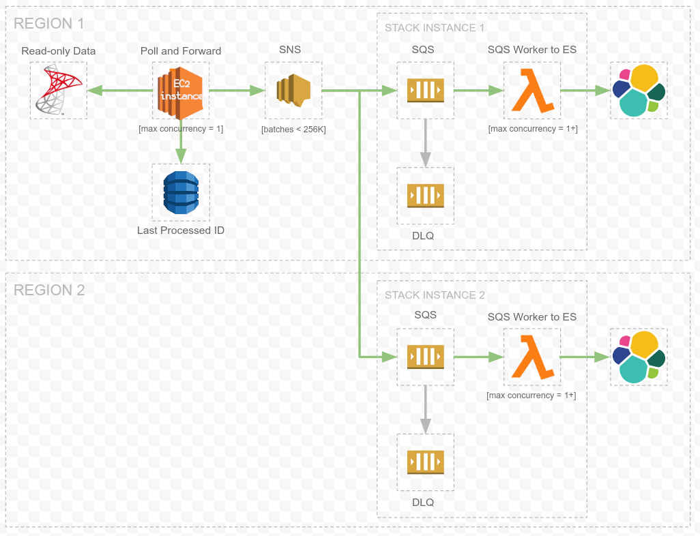

# ElasticSearch Import Project

The overall task of this project is to move data from Eleven's T-SQL database into ElasticSearch. 
We have 02 Elasticsearch clusters in production. One in US-EAST and another in US-WEST, both should have the exact same copy of data.

This project is split into: 

- 03 lambda functions under `lambdas/` folder.
- A normal Python script that should continuously run and fetch data from a MSSQL DB, under `esimport/` folder.

## How it works


What's under `esimport/` queries the MSSQL DB continuously for some types of records and sends the result (as an array of JSON records) to an [AWS SNS](https://aws.amazon.com/sns/) topic.

The type of records we get from the MSSQL DB so far are called:
- `properties`: think of this as records for hotels (names, address, info) or some sites/buildings. Those sites are serving WiFi via Eleven's offerings. 
- `conferences`: some special events occupying some place/room, with potentially special WiFi access.
- `devices`: the device the end user used to login to Eleven's WiFi.
- `sessions`: info about the lifetime of the user access to the WiFi, browser used to login, the Plan the use chose ..etc
- `accounts`: the actual user profile created when the user first logins in one the WiFi plans offered by Eleven.

Once run:
- We bulk-fetch a number of records for each record type, and send it to the SNS topic.
- We write the last record ID for each record type in a [DynamoDB](https://aws.amazon.com/dynamodb/) table, so when esimport is interrupted or restarted, it'd know from where to resume by referring back to that same DynamoDB table.

The SNS topic is subscribed-to by 02 [AWS SQS](https://aws.amazon.com/sqs/) queues, one in US-EAST, the other in US-WEST.

Each SQS queue is consumed by a lambda function under `lambdas/sqs_consumer/`, this function (deployed twice, in us-east and in us-west) pops an item from its 
target SQS queue (depending on the region) and indexes the content of the item (an array of records) into its target Elasticsearch cluster 
(the cluster residing in the same lambda function's region).


The following picture illustrates the overall architecture of this project:


## Setup and contributing

Contributing to this project requires you having Docker and docker-compose installed. We mock the different AWS services using [localstack](https://github.com/localstack/localstack).

This project includes a [Dockerfile](Dockerfile) that uses the same Linux distribution as production. and a `docker-compose.yml` file ready for local development use.
Both of these files should be self-explanatory and you're encouraged to read them.

- Copy `.env-example` file included within this into `.env` file.
- Run `make shell`. This will drop you in a bash shell in a separate docker container, with `esimport` CLI available and tests ready to invoke. 

`make shell` will pull localstack, Redis, MSSQL Server docker images for you, and have them running before you're dropped into the esimport container shell. 

You can continue making changes to the codebase while having the shell open, just invoke `esimport` again inside the same container's shell you're 
already dropped into to see your changes or to invoke the test suite, no need to rebuild. 
This is because the `esimport` cli is installed with `pip install -e .` (`-e` for editable install so you can modify freely).


## Usage

esimport syncs (or updates) 05 types of documents to Elasticsearch, accounts, conferences, devices, properties and sessions. This can be done with:

```bash
$ esimport sync [accounts|conferences|devices|sessions|properties]
```

All of the above commands accept `--start-date` argument, e.g.

```bash
$ esimport sync sessions --start-date 2020-01-01
```


## How to run tests?

If you want to test against a local base.Dockerfile, build that, then update dev.Dockerfile to reference this instead of registry.gitlab.com/distrodev/esimport:base

Run `make test`


## Troubleshooting

pyodbc.InterfaceError: ('IM002', '[IM002] [unixODBC][Driver Manager]Data source name not found and no default driver specified (0) (SQLDriverConnect)

run and makes sure the data sources file odbc.ini is populated/confiured properly.
run below command to see odbc config settings.

```odbcinst -j ```

## The ECR repo for prod was created manually

## Deploy user, access keys, roles etc..
You can create user, policies & roles that is used for deployment using `deploy_cicd_permission_policy.sh` script.
